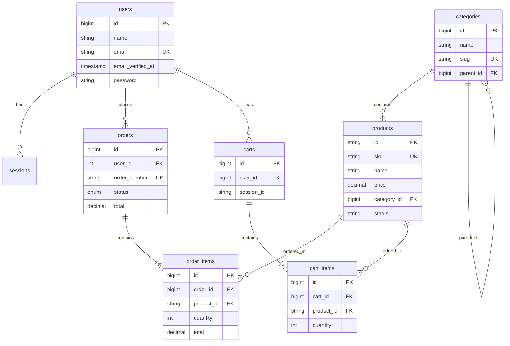

# Database Schema - webapp_db

**Database Name:** `webapp_db`  
**Connection:** MySQL  
**Host:** 127.0.0.1:3306  

---

## Tables

### 1. users
| Column | Type | Attributes |
|--------|------|------------|
| id | bigint unsigned | PRIMARY KEY, AUTO_INCREMENT |
| first_name | varchar(255) | |
| middle_name | varchar(255) | NULLABLE |
| last_name | varchar(255) | |
| email | varchar(255) | UNIQUE |
| password_hash | varchar(255) | (bcrypt hashed) |
| address1 | text | NULLABLE |
| address2 | text | NULLABLE |
| country_code | varchar(10) | NULLABLE |
| phone | varchar(50) | NULLABLE |
| role | varchar(50) | DEFAULT 'customer' |
| created_at | timestamp | NULLABLE |
| updated_at | timestamp | NULLABLE |

---

### 2. password_reset_tokens
| Column | Type | Attributes |
|--------|------|------------|
| email | varchar(255) | PRIMARY KEY |
| token | varchar(255) | |
| created_at | timestamp | NULLABLE |

---

### 3. sessions
| Column | Type | Attributes |
|--------|------|------------|
| id | varchar(255) | PRIMARY KEY |
| user_id | bigint unsigned | NULLABLE, INDEX |
| ip_address | varchar(45) | NULLABLE |
| user_agent | text | NULLABLE |
| payload | longtext | |
| last_activity | int | INDEX |

---

### 4. cache
| Column | Type | Attributes |
|--------|------|------------|
| key | varchar(255) | PRIMARY KEY |
| value | mediumtext | |
| expiration | int | |

---

### 5. cache_locks
| Column | Type | Attributes |
|--------|------|------------|
| key | varchar(255) | PRIMARY KEY |
| owner | varchar(255) | |
| expiration | int | |

---

### 6. jobs
| Column | Type | Attributes |
|--------|------|------------|
| id | bigint unsigned | PRIMARY KEY, AUTO_INCREMENT |
| queue | varchar(255) | INDEX |
| payload | longtext | |
| attempts | tinyint unsigned | |
| reserved_at | int unsigned | NULLABLE |
| available_at | int unsigned | |
| created_at | int unsigned | |

---

### 7. job_batches
| Column | Type | Attributes |
|--------|------|------------|
| id | varchar(255) | PRIMARY KEY |
| name | varchar(255) | |
| total_jobs | int | |
| pending_jobs | int | |
| failed_jobs | int | |
| failed_job_ids | longtext | |
| options | mediumtext | NULLABLE |
| cancelled_at | int | NULLABLE |
| created_at | int | |
| finished_at | int | NULLABLE |

---

### 8. failed_jobs
| Column | Type | Attributes |
|--------|------|------------|
| id | bigint unsigned | PRIMARY KEY, AUTO_INCREMENT |
| uuid | varchar(255) | UNIQUE |
| connection | text | |
| queue | text | |
| payload | longtext | |
| exception | longtext | |
| failed_at | timestamp | DEFAULT CURRENT_TIMESTAMP |

---

### 9. products
| Column | Type | Attributes |
|--------|------|------------|
| id | varchar(255) | PRIMARY KEY (non-incrementing) |
| sku | varchar(255) | NULLABLE, UNIQUE, INDEX |
| barcode | varchar(255) | NULLABLE, INDEX |
| name | varchar(255) | |
| description | text | NULLABLE |
| price | decimal(10,2) | |
| compare_at_price | decimal(10,2) | NULLABLE |
| cost_per_item | decimal(10,2) | NULLABLE |
| stock_quantity | int | DEFAULT 0, INDEX |
| track_inventory | boolean | DEFAULT TRUE |
| continue_selling_when_out_of_stock | boolean | DEFAULT FALSE |
| featured | boolean | DEFAULT FALSE, INDEX |
| status | enum('active','draft','archived') | DEFAULT 'active', INDEX |
| category | varchar(255) | NULLABLE |
| category_id | bigint unsigned | NULLABLE, INDEX |
| vendor | varchar(255) | NULLABLE, INDEX |
| product_type | varchar(255) | NULLABLE |
| tags | text | NULLABLE |
| image_url | varchar(255) | NULLABLE |
| images | json | NULLABLE |
| weight | decimal(10,3) | NULLABLE |
| weight_unit | enum('kg','g','lb','oz') | DEFAULT 'kg' |
| requires_shipping | boolean | DEFAULT TRUE |
| length | decimal(10,2) | NULLABLE |
| width | decimal(10,2) | NULLABLE |
| height | decimal(10,2) | NULLABLE |
| dimension_unit | enum('cm','in','m') | DEFAULT 'cm' |
| taxable | boolean | DEFAULT TRUE |
| tax_code | varchar(255) | NULLABLE |
| seo_title | varchar(255) | NULLABLE |
| seo_description | text | NULLABLE |
| metafields | json | NULLABLE |
| created_at | timestamp | NULLABLE |
| updated_at | timestamp | NULLABLE |

---

### 10. categories
| Column | Type | Attributes |
|--------|------|------------|
| id | bigint unsigned | PRIMARY KEY, AUTO_INCREMENT |
| name | varchar(255) | |
| slug | varchar(255) | UNIQUE |
| description | text | NULLABLE |
| image_url | varchar(255) | NULLABLE |
| parent_id | bigint unsigned | NULLABLE, INDEX, FK → categories.id (SET NULL) |
| sort_order | int | DEFAULT 0 |
| is_active | boolean | DEFAULT TRUE |
| created_at | timestamp | NULLABLE |
| updated_at | timestamp | NULLABLE |

---

### 11. orders
| Column | Type | Attributes |
|--------|------|------------|
| id | bigint unsigned | PRIMARY KEY, AUTO_INCREMENT |
| user_id | int unsigned | NULLABLE, INDEX |
| order_number | varchar(255) | UNIQUE |
| status | enum('pending','processing','shipped','delivered','cancelled') | DEFAULT 'pending', INDEX |
| subtotal | decimal(10,2) | DEFAULT 0 |
| tax | decimal(10,2) | DEFAULT 0 |
| shipping | decimal(10,2) | DEFAULT 0 |
| total | decimal(10,2) | DEFAULT 0 |
| shipping_first_name | varchar(255) | NULLABLE |
| shipping_last_name | varchar(255) | NULLABLE |
| shipping_email | varchar(255) | NULLABLE |
| shipping_phone | varchar(255) | NULLABLE |
| shipping_address1 | text | NULLABLE |
| shipping_address2 | text | NULLABLE |
| shipping_city | varchar(255) | NULLABLE |
| shipping_state | varchar(255) | NULLABLE |
| shipping_zip | varchar(255) | NULLABLE |
| shipping_country | varchar(255) | NULLABLE |
| notes | text | NULLABLE |
| created_at | timestamp | NULLABLE, INDEX |
| updated_at | timestamp | NULLABLE |

**Composite Index:** `(status, created_at)`

---

### 12. order_items
| Column | Type | Attributes |
|--------|------|------------|
| id | bigint unsigned | PRIMARY KEY, AUTO_INCREMENT |
| order_id | bigint unsigned | FK → orders.id (CASCADE DELETE) |
| product_id | varchar(255) | FK → products.id (NULL ON DELETE) |
| product_name | varchar(255) | |
| product_price | decimal(10,2) | |
| quantity | int | DEFAULT 1 |
| total | decimal(10,2) | |
| created_at | timestamp | NULLABLE |
| updated_at | timestamp | NULLABLE |

---

### 13. carts
| Column | Type | Attributes |
|--------|------|------------|
| id | bigint unsigned | PRIMARY KEY, AUTO_INCREMENT |
| user_id | bigint unsigned | NULLABLE, INDEX, UNIQUE |
| session_id | varchar(255) | NULLABLE, INDEX, UNIQUE |
| created_at | timestamp | NULLABLE |
| updated_at | timestamp | NULLABLE |

---

### 14. cart_items
| Column | Type | Attributes |
|--------|------|------------|
| id | bigint unsigned | PRIMARY KEY, AUTO_INCREMENT |
| cart_id | bigint unsigned | FK → carts.id (CASCADE DELETE) |
| product_id | varchar(255) | INDEX |
| quantity | int | DEFAULT 1 |
| created_at | timestamp | NULLABLE |
| updated_at | timestamp | NULLABLE |

**Unique Constraint:** `(cart_id, product_id)`

---

## Entity Relationship Diagram

